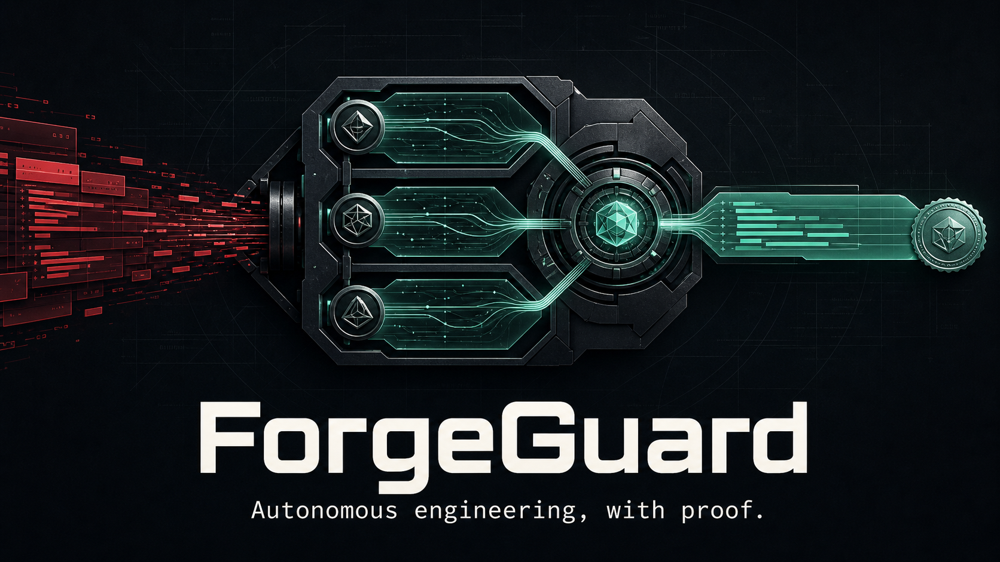
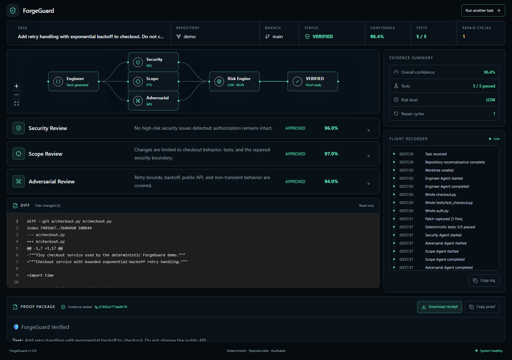
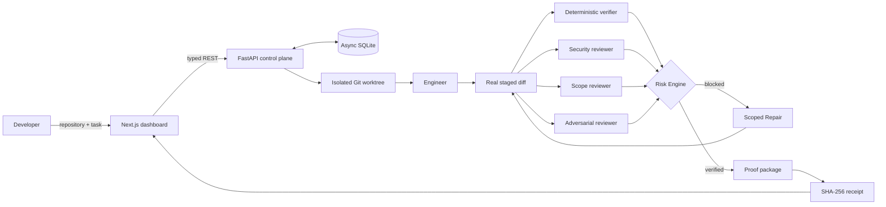
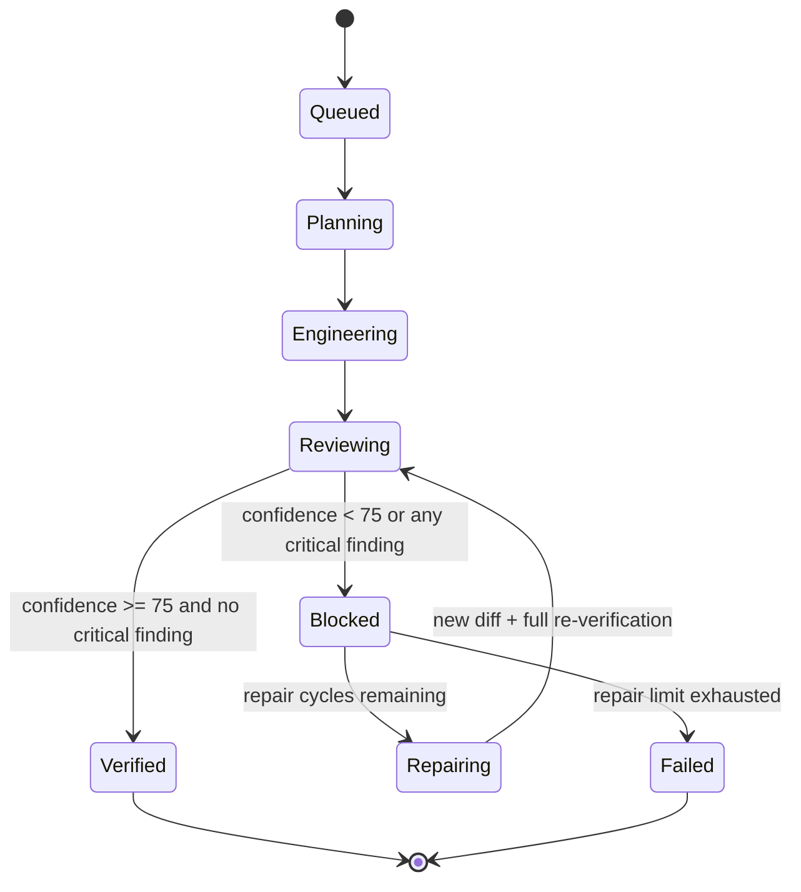
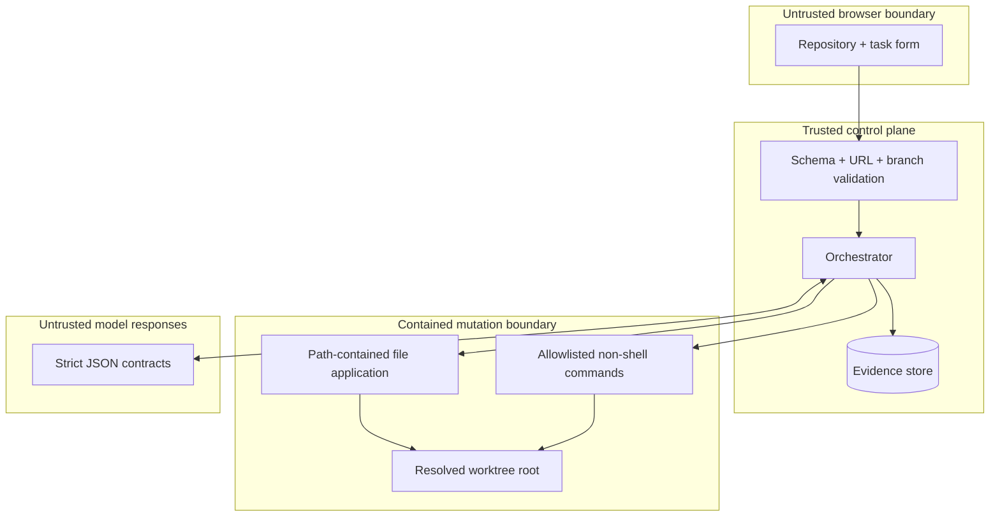

<div align="center">

# ForgeGuard

### Autonomous engineering, with proof.

**A verification, supervision, and recovery layer for autonomous coding agents.**

[](#architecture)
[](#architecture)
[](#verification-matrix)
[](#run-the-live-demo)
[](#tamper-evident-verification-receipt)

Codex can write the code. ForgeGuard makes autonomous coding accountable.

</div>

---

## The problem in 60 seconds

An AI coding agent can return a convincing patch and a green test suite while quietly weakening authorization, changing a public contract, or touching files outside the task. Passing tests prove that selected behaviors still work. They do **not** prove that the change is safe, scoped, or ready to ship.

ForgeGuard makes every autonomous patch earn a verdict:

1. The Engineer works inside an isolated Git worktree.
2. Deterministic tests and build checks inspect the real staged diff.
3. Security, Scope, and Adversarial reviewers challenge the patch independently.
4. A deterministic Risk Engine combines the evidence and blocks unsafe work.
5. A bounded Repair agent fixes only the reported findings and re-runs the entire loop.
6. ForgeGuard emits a human-readable proof package and a machine-readable, SHA-256-sealed verification receipt.

The result is not “the agent says it worked.” It is a replayable chain of evidence showing **what changed, what challenged it, why it was blocked or verified, and whether the evidence was altered afterward**.

## Why this is a strong Codex hackathon project

| Judging signal | ForgeGuard evidence |
|---|---|
| **What was built** | A deployable autonomous engineering control plane, not a static prototype: API, persistence, isolated worktrees, provider adapters, reviewers, repair loop, dashboard, and proof artifacts. |
| **Meaningful Codex use** | The project turns core agentic engineering patterns—worktrees, bounded execution, parallel review, structured outputs, deterministic verification, and recovery—into a coherent developer workflow. Codex was also used as the repository-native engineering partner to design, implement, test, visually verify, and document the submission. |
| **Clear demonstration** | The bundled demo deliberately creates a patch whose tests pass while authorization is weakened. Judges see ForgeGuard catch it, block it, repair it, verify again, and download the sealed receipt in under three minutes. |

## The moment that matters

> **The tests pass. ForgeGuard still blocks the patch.**

That is the whole product in one sentence. The deterministic demo adds valid exponential-backoff retry handling to checkout, but its first Engineer pass also removes an authorization boundary in `auth.py`. Checkout tests remain green. Security and Scope independently detect the unrelated regression, the Risk Engine blocks the patch, Repair restores the role check, and every evidence channel runs again before the final `VERIFIED` decision.

<p align="center">
  
</p>

## What ForgeGuard ships today

- **Real repository isolation** — local and GitHub repositories run in contained Git worktrees.
- **Independent reviewer fan-out** — Security, Scope, and Adversarial reviewers evaluate the same captured patch independently.
- **Deterministic evidence** — test/build commands are detected by ForgeGuard; model output never supplies shell commands.
- **Explainable risk** — the score, blocking threshold, critical override, and every finding are visible.
- **Bounded recovery** — only high/critical findings are handed to Repair, with at most two cycles.
- **Flight recorder** — every state transition, agent run, write, test, review, block, repair, and verdict is timestamped.
- **Proof package** — concise Markdown for humans, suitable for a pull request or audit note.
- **Verification receipt** — portable JSON with artifact hashes and a deterministic ForgeGuard receipt ID.
- **Two execution modes** — a zero-key deterministic showcase and provider-backed work on real repositories.
- **Production-shaped delivery** — FastAPI, async SQLite, Next.js, Docker, Render, Vercel, CI, and responsive browser tests.

## Architecture



### Verification and recovery loop



### What happens during the showcase

```mermaid
sequenceDiagram
    actor Dev as Developer
    participant FG as ForgeGuard API
    participant W as Isolated Worktree
    participant E as Engineer
    participant V as Tests + Reviewers
    participant R as Risk Engine
    participant F as Repair

    Dev->>FG: Add retry handling; preserve the public API
    FG->>W: Create contained worktree
    FG->>E: Produce structured file changes
    E->>W: Retry patch + unrelated auth regression
    W-->>FG: Captured staged diff
    FG->>V: Run tests and 3 independent reviews
    V-->>R: Tests 5/5, Security critical, Scope high
    R-->>FG: BLOCKED
    FG->>F: Repair only the findings
    F->>W: Restore authorization boundary
    FG->>V: Re-run all evidence
    V-->>R: Tests 5/5, reviews approved
    R-->>FG: VERIFIED
    FG-->>Dev: Proof package + sealed JSON receipt
```

## Risk is deterministic, not vibes

ForgeGuard uses the exact weighted confidence formula:

```text
overall confidence =
    0.30 × security
  + 0.20 × scope
  + 0.30 × adversarial
  + 0.20 × deterministic tests
```

The deterministic test channel contributes `100` only when **at least one test ran and every test passed**. Otherwise it contributes `0`.

| Rule | Decision |
|---|---|
| Any reviewer returns `critical` | `BLOCKED`, regardless of weighted score |
| Overall confidence below `60` or any critical finding | `HIGH` risk |
| Overall confidence `60–74.99` | `MEDIUM` risk and `BLOCKED` |
| Overall confidence at least `75`, no critical finding | `LOW` risk and `VERIFIED` |

## Tamper-evident verification receipt

The proof endpoint returns the existing Markdown proof plus a machine-readable receipt after a terminal decision:

```text
GET /api/tasks/{task_id}/proof
              │
              ├── markdown: human-readable evidence
              └── receipt
                   ├── task + repository + changed files
                   ├── tests + reviewers + risk + repair count
                   ├── agent runs + flight-recorder events
                   ├── SHA-256(diff)
                   ├── SHA-256(markdown proof)
                   └── SHA-256(canonical evidence payload)
```

The receipt ID is `fg_` plus the first 16 hexadecimal characters of the canonical evidence digest. The UI displays that identity and downloads the complete JSON artifact.

Verify a downloaded receipt independently:

```python
import hashlib
import json
from pathlib import Path

receipt = json.loads(Path("forgeguard-fg_example.json").read_text())
payload = {
    key: value
    for key, value in receipt.items()
    if key not in {"receipt_id", "integrity"}
}
canonical = json.dumps(
    payload,
    ensure_ascii=False,
    separators=(",", ":"),
    sort_keys=True,
)
digest = hashlib.sha256(canonical.encode()).hexdigest()

assert receipt["integrity"] == {"algorithm": "sha256", "digest": digest}
assert receipt["receipt_id"] == f"fg_{digest[:16]}"
```

This is an integrity seal, not a cryptographic identity signature. A future release can sign the digest through KMS or Sigstore without changing the evidence payload.

## Run the live demo

### Requirements

- Python 3.11+
- Node.js 20+
- npm
- Git

### 1. Start the backend

```bash
cd backend
python -m venv .venv

# Windows
.venv\Scripts\activate

# macOS / Linux
# source .venv/bin/activate

pip install -r requirements-dev.txt
copy .env.example .env
python -m uvicorn app.main:app --reload --port 8000
```

For macOS/Linux, replace `copy` with `cp`.

The safe template defaults to `DEMO_MODE=true`; the showcase requires no provider keys.

### 2. Start the dashboard

```bash
cd frontend
npm install
copy .env.example .env.local
npm run dev
```

Open [http://localhost:3000](http://localhost:3000).

### 3. Use the exact showcase input

| Field | Value |
|---|---|
| Repository | `demo` |
| Branch | `main` |
| Engineering task | `Add retry handling with exponential backoff to checkout. Do not change the public API.` |

Click **Start autonomous engineering**. The complete block → repair → verify story normally finishes in seconds because demo agents are deterministic and local.

## Use real providers and repositories

Keep secrets only in `backend/.env`:

```dotenv
DEMO_MODE=false
OPENAI_API_KEY=
GROQ_API_KEY=
GITHUB_TOKEN=
```

Then submit either a local repository path or an HTTPS GitHub URL. The browser never receives provider credentials. Webhook signing is optional for the current task API and can be configured later with `GITHUB_WEBHOOK_SECRET`.

> Never put provider credentials in `frontend/.env.local`, a `NEXT_PUBLIC_*` variable, or a tracked `.env.example` file.

## API surface

Interactive documentation is available at `http://localhost:8000/api/docs`.

| Method | Route | Purpose |
|---|---|---|
| `GET` | `/api/health` | Service health check |
| `POST` | `/api/tasks` | Validate and schedule an autonomous engineering task |
| `GET` | `/api/tasks/{id}` | Task state, scores, evaluations, and agent runs |
| `GET` | `/api/tasks/{id}/flight-log` | Ordered execution trace |
| `GET` | `/api/tasks/{id}/diff` | Captured staged Git diff |
| `GET` | `/api/tasks/{id}/proof` | Markdown proof plus nullable sealed receipt |
| `POST` | `/api/tasks/{id}/repair` | Idempotent manual retry for an eligible blocked task |

Example task request:

```bash
curl -X POST http://localhost:8000/api/tasks \
  -H "Content-Type: application/json" \
  -d '{
    "repo_url": "demo",
    "branch": "main",
    "description": "Add retry handling with exponential backoff to checkout. Do not change the public API."
  }'
```

## Repository map

```text
forgeguard/
├── backend/
│   ├── app/
│   │   ├── agents/           # Engineer, reviewers, Repair, deterministic demo
│   │   ├── core/             # Worktrees, verifier, risk, orchestration, proof
│   │   ├── providers/        # Strict OpenAI and Groq JSON adapters
│   │   ├── routers/          # Health and task lifecycle API
│   │   ├── db.py             # Async SQLAlchemy session boundary
│   │   ├── models.py         # Persisted projects, tasks, runs, evidence
│   │   └── schemas.py        # Validated external and agent contracts
│   └── tests/                # Unit, API, orchestration, and safety tests
├── frontend/
│   ├── app/                  # Next.js App Router surfaces
│   ├── components/           # Dashboard, graph, reviews, diff, proof
│   ├── hooks/                # Terminal-aware evidence polling
│   ├── lib/                  # Typed API client and domain contracts
│   ├── tests/                # Vitest + Testing Library
│   └── e2e/                  # Desktop and mobile Playwright journeys
├── demo-repo/                # Reproducible vulnerable-then-repaired story
├── docs/
│   ├── assets/               # README poster
│   ├── design/               # Accepted UI concepts
│   ├── qa/                   # Browser evidence and fidelity ledger
│   └── superpowers/          # Design specifications and implementation plans
├── .github/workflows/ci.yml
├── render.yaml
└── README.md
```

## Security model

ForgeGuard treats model output as untrusted input.



Current controls include:

- credentials remain server-side and secret-bearing repository URLs are rejected;
- branch names and repository inputs are validated before Git operations;
- every model-returned path must remain inside the resolved worktree root;
- `.git` targets and symlink escapes are rejected;
- subprocesses use argument arrays, never a shell;
- model output is parsed through strict JSON contracts with deadlines and one retry;
- stored provider and command output is bounded;
- unhandled orchestration errors persist a terminal failure state;
- blocked worktrees are preserved when useful forensic evidence exists.

ForgeGuard is currently a controlled hackathon service, not a public multi-tenant SaaS. Authentication, tenant isolation, signed identities, and remote execution sandboxes belong in the production roadmap.

## Verification matrix

| Layer | Coverage | Command |
|---|---:|---|
| Backend | 39 tests | `cd backend && python -m pytest` |
| Python quality | Ruff rules | `cd backend && python -m ruff check app tests` |
| Frontend | 7 tests | `cd frontend && npm test -- --run` |
| Frontend types | TypeScript | `cd frontend && npm run typecheck` |
| Production bundle | Next.js | `cd frontend && npm run build` |
| Full browser flow | 4 desktop/mobile journeys | `cd frontend && npm run test:e2e` |
| Demo repository | 3 tests | `cd demo-repo && python -m pytest` |
| Container | Backend image | `docker build -f backend/Dockerfile -t forgeguard-api .` |

Run the complete local gate:

```bash
cd backend
python -m pytest
python -m ruff check app tests

cd ../frontend
npm test -- --run
npm run lint
npm run typecheck
npm run build
npx playwright install chromium
npm run test:e2e

cd ../demo-repo
python -m pytest
```

## Deployment

### Render backend

Create a Blueprint from this repository. [`render.yaml`](render.yaml) builds the non-root backend container, mounts persistent SQLite storage, and checks `/api/health`.

Configure these secrets in Render, never in Git:

- `OPENAI_API_KEY`
- `GROQ_API_KEY`
- `GITHUB_TOKEN`
- `GITHUB_WEBHOOK_SECRET` when webhook ingestion is added
- `ALLOWED_ORIGINS` set to the deployed frontend origin

### Vercel frontend

Import the repository, set the Root Directory to `frontend`, and configure:

```dotenv
NEXT_PUBLIC_API_URL=https://forgeguard-api.example.com
```

## How Codex was used

Codex was treated as an engineering collaborator operating inside the repository—not as a one-shot code generator.

- **Reconnaissance:** mapped the existing architecture, contracts, UI, test suite, and deployment shape before changing behavior.
- **Design:** compared presentation-only, broad expansion, and proof-first approaches; selected the smallest capability that strengthened the live story.
- **Test-first implementation:** wrote and observed failing backend and frontend tests before adding receipt generation, API serialization, polling, and downloads.
- **Isolation:** executed feature work in a dedicated Git worktree and merged only after verification.
- **Adversarial debugging:** traced a TypeScript check failure and a PowerShell GitHub probe failure to their actual causes instead of guessing.
- **Visual production:** generated the project poster, preserved the accepted dashboard design system, and performed desktop/mobile screenshot review.
- **Verification:** exercised deterministic and provider-backed paths, builds, linting, types, browser automation, secret scans, and containerization.

The product mirrors those same disciplines for every autonomous patch: isolate, inspect, challenge, repair, verify, and preserve proof.

## Three-minute pitch

1. **Problem — 20 seconds:** “AI agents can ship patches that pass tests and still weaken security or violate scope.”
2. **Task — 20 seconds:** submit the exact checkout retry task.
3. **Build — 25 seconds:** point to the isolated Engineer node and real diff.
4. **Twist — 35 seconds:** tests pass, but Security finds the authorization regression and ForgeGuard blocks the patch.
5. **Recovery — 35 seconds:** Repair restores the role check and the whole evidence graph runs again.
6. **Proof — 30 seconds:** show `VERIFIED`, the flight recorder, Markdown proof, and downloaded `fg_…` receipt.
7. **Close — 15 seconds:** “Codex can write the code. ForgeGuard makes autonomous coding accountable.”

## Roadmap

- Sign receipt digests through Sigstore or a cloud KMS.
- Create pull requests with proof attached as a check run.
- Add policy-as-code for repository-specific risk thresholds.
- Run untrusted builds in ephemeral remote sandboxes.
- Add authenticated teams, approval gates, and evidence retention policies.
- Benchmark reviewer calibration against a public adversarial patch corpus.

---

<div align="center">

**Built for the OpenAI Codex Community Hackathon — Bengaluru, August 2026.**

*Build fast. Challenge independently. Ship with proof.*

</div>
